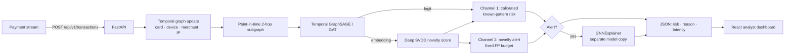

# FinGuard-XAI
### Real-Time, Explainable Graph AI for Detecting Coordinated Payment Fraud

[](../../actions/workflows/ci.yml)
[](https://colab.research.google.com/github/sibbirhossain/finguard-xai/blob/main/notebooks/01_problem_and_motivation.ipynb)
[](paper/finguard_xai.pdf)   

---

## The problem
Fraud against U.S. consumers, businesses, and public programs is large and growing:

| Source | Finding |
|---|---|
| **Federal Trade Commission** (Mar 2025) | Consumers reported losing **$12.5 billion** to fraud in 2024, a **25% increase** over 2023 |
| **FBI Internet Crime Complaint Center** (2024 report) | **$16.6 billion** in reported cybercrime losses, up **33%**; cyber-enabled fraud made up $13.7 billion |
| **U.S. Government Accountability Office**, GAO-24-105833 (Apr 2024) | The federal government loses an estimated **$233–$521 billion per year** to fraud |

Much of this loss comes from **organized** fraud. Rings of cards route activity through shared, often compromised, devices and IP addresses and cash out through a few colluding merchants. Each transaction can look ordinary on its own, so models that score transactions **one at a time** miss the pattern. A second problem is that supervised models learn *yesterday's* fraud, so a new attack tactic can pass undetected.

## The solution
FinGuard-XAI models every payment as part of a **live, time-aware graph** of cards, devices, merchants, and IP addresses. It scores each transaction in milliseconds using the relationships around it.

1. **Streaming temporal graph.** Updated with every event and queried *point-in-time*, so no future information can leak into a decision. This is verified by tests.
2. **Temporal graph neural network.** GraphSAGE or GAT with learned time encoding, trained on the transaction's 2-hop neighborhood.
3. **Dual-channel alerting.** A supervised channel handles known fraud patterns. An independent **novelty channel** (Deep SVDD with a fixed, auditable false-positive budget) catches fraud types the model has **never seen**.
4. **Explanation for every alert.** GNNExplainer shows analysts which devices, IPs, merchants, and links drove the decision.
5. **Adversarial robustness testing.** Detection is measured under simulated evasion attacks (device dispersion, camouflage).
6. **Production-style service.** FastAPI scoring API, live React dashboard, measured p50/p95/p99 latency, tests, and CI.

## Key results — 5 independent seeds, 95% confidence intervals
Source: [`reports/EXPERIMENTS.md`](reports/EXPERIMENTS.md), reproducible with one command. Controlled synthetic data with documented fraud scenarios; a public-benchmark pipeline is included ([notebook 07](https://colab.research.google.com/github/sibbirhossain/finguard-xai/blob/main/notebooks/07_public_benchmark_ieee_cis.ipynb)).

| | Conventional model (gradient-boosted trees, no graph) | **FinGuard-XAI temporal GNN** |
|---|---|---|
| PR-AUC (key metric for rare fraud) | 0.701 [0.608, 0.805] | **0.933 [0.908, 0.957]** |
| Fraud caught (recall) | 71.9% | **89.5%** |
| Legitimate transactions wrongly flagged (FPR) | 2.50% | **0.60%**, about 4× fewer false alarms |

**Never-seen fraud.** Account takeover was removed from all training and validation data:

| | Supervised GNN only | **+ dual-channel novelty alerting** |
|---|---|---|
| Never-seen fraud caught | 5.9% | **33.5%** (≈5.7× more) |
| Known fraud rings caught | 94.8% | **95.6%** |
| False-positive rate | 0.19% | 0.91% (the stated cost of the novelty budget) |

**Adaptive attackers.** The system was frozen after training, and fraud rings then tried to evade it:

| Attack on fraud rings | Supervised GNN only | **+ dual-channel** |
|---|---|---|
| None | 97.3% caught | 97.3% |
| Device dispersion (fresh device and IP per purchase) | 98.1% | 98.8% |
| Camouflage (benign purchases mixed in) | 91.8% | **96.8%** |
| Combined attack | 83.9% ± 20.1% (unstable) | **97.6% ± 3.0%** |

The dual channel keeps detection stable under attack; the cost is a false-positive rate of about 1.4% vs 0.6%. See [`reports/robustness/ROBUSTNESS.md`](reports/robustness/ROBUSTNESS.md) and [notebook 08](https://colab.research.google.com/github/sibbirhossain/finguard-xai/blob/main/notebooks/08_adversarial_robustness.ipynb).

**Real-time performance.**
- Scoring (graph update + GNN + anomaly + fusion): **p95 4.7 ms per transaction on a single CPU thread**, about 260 transactions/second per thread.
- Explanations take about 100 ms, run only for alerts, and are kept off the scoring path.

## Interactive notebooks (run in Google Colab, no setup)
| Notebook | What it shows |
|---|---|
| [01 · The Problem](https://colab.research.google.com/github/sibbirhossain/finguard-xai/blob/main/notebooks/01_problem_and_motivation.ipynb) | U.S. fraud-loss evidence; why fraud rings are invisible transaction-by-transaction |
| [02 · Solution & Benchmark](https://colab.research.google.com/github/sibbirhossain/finguard-xai/blob/main/notebooks/02_solution_and_benchmark.ipynb) | Trains the model live; 5-seed comparison with conventional ML |
| [03 · Explainable Alerts](https://colab.research.google.com/github/sibbirhossain/finguard-xai/blob/main/notebooks/03_explainable_alerts.ipynb) | A flagged transaction and the fraud-ring subgraph that explains it |
| [04 · Never-Seen Fraud](https://colab.research.google.com/github/sibbirhossain/finguard-xai/blob/main/notebooks/04_unseen_fraud_generalization.ipynb) | The generalization problem, the design fix, and its measured trade-off |
| [05 · Real-Time Performance](https://colab.research.google.com/github/sibbirhossain/finguard-xai/blob/main/notebooks/05_realtime_performance.ipynb) | Latency distribution over 2,000 live scoring calls |
| [06 · Operational Impact](https://colab.research.google.com/github/sibbirhossain/finguard-xai/blob/main/notebooks/06_impact_scenario_analysis.ipynb) | Scenario model converting measured detection rates into alert volume and dollars (editable assumptions) |
| [08 · Adversarial Robustness](https://colab.research.google.com/github/sibbirhossain/finguard-xai/blob/main/notebooks/08_adversarial_robustness.ipynb) | How detection holds up when fraud rings actively evade it |
| [07 · Public Benchmark](https://colab.research.google.com/github/sibbirhossain/finguard-xai/blob/main/notebooks/07_public_benchmark_ieee_cis.ipynb) | Same pipeline on the public IEEE-CIS dataset (590k real anonymized transactions) |

Notebooks 01–06 and 08 are committed **with their outputs**, so every chart is visible on GitHub without running anything.

## Architecture


## Methodology
| Stage | Implementation |
|---|---|
| Graph | 4 node types; typed edges card–device, card–merchant, card–IP, device–IP; edge features: log-amount, elapsed time, relation. Each node keeps its most recent 64 interactions, so memory and latency stay bounded as history grows. |
| Leakage control | Node features (activity, mean amount, fan-out, recency, age) come only from past events. Chronological 70/15/15 split; thresholds chosen on validation only. |
| Model | 2-layer temporal GraphSAGE (default) or GAT; time encoding cos(w·Δt+b); representation = embeddings of the transaction's 4 entities + transaction features. |
| Class imbalance | Class-weighted BCE; PR-AUC as the headline metric; F1-optimal validation threshold. |
| Known-pattern channel | Logistic-regression stacker over the GNN logit and anomaly score, giving a calibrated probability with learned weights. |
| Novelty channel | Deep SVDD on legitimate-only embeddings; alert above the 99.5th percentile of legitimate validation traffic (configurable `novelty_fpr`). |
| Explainability | GNNExplainer edge and node masks; ranked entities and relations returned with each alert. |
| Statistics | 5 seeds with independently generated data; mean ± std; 95% bootstrap CIs. |

## Where this applies
The method needs only pseudonymous identifiers (card, device, merchant, network) and timestamps, which nearly every payment system records. It therefore applies to **banks and card issuers, payment processors and fintechs, e-commerce platforms, and public-benefit payment programs**. The code is MIT-licensed, so any institution can evaluate it on its own data. See [`docs/IMPACT.md`](docs/IMPACT.md) for how measured results map to operational outcomes, and what remains to be shown.

## Quick start
```bash
pip install torch --index-url https://download.pytorch.org/whl/cpu && pip install -r requirements.txt
python -m src.models.train                          # train + evaluate (~1-2 min)
python -m src.experiments.run_experiments           # full 5-seed suite (~12 min)
python -m src.experiments.robustness --seed 0 1 2 3 4 --aggregate   # adversarial study (~10 min)
python paper/make_paper.py && cd paper && pdflatex finguard_xai.tex   # rebuild the preprint from reports/
uvicorn src.api.main:app --port 8000                # API docs at /docs
python -m src.api.stream_simulator --n 3000 --rate 100
cd frontend && npm install && npm run dev           # dashboard at localhost:5173
```
Public data: `python -m src.models.train --data ieee-cis --data-dir data/ieee-cis` (see notebook 07). Tests: `pytest -q`.

## API
| Method | Path | Returns |
|---|---|---|
| POST | `/api/v1/transactions` | `risk_score`, `is_alert`, `alert_reason` (known / novel pattern), component scores, latency breakdown, explanation |
| GET | `/api/v1/alerts` · `/api/v1/transactions/recent` · `/api/v1/stats` · `/health` | Alerts, live feed, risk histogram + latency percentiles, health |
| GET | `/api/v1/drift` | Population Stability Index of live traffic vs. calibration data (stable / moderate / significant shift) |

Security: optional API-key auth (`FINGUARD_API_KEY`), strict input validation, restricted CORS. Only pseudonymous identifiers are accepted, never raw personal data. Load only model artifacts you trained yourself.

## Limitations (stated deliberately)
- Headline results use controlled synthetic data. Real-world performance must be established on institution data; the public-benchmark pipeline is the first step.
- Explanations describe model behavior. They are not proof of fraud or causality.
- The novelty channel increases false positives in exchange for catching unseen fraud; the budget is configurable.
- Single-process in-memory graph. Horizontal scaling would require a shared graph store.
- Adversarial tests use heuristic attackers; white-box attacks with knowledge of the model are not yet evaluated. Ring counts per test window are small (32–125), so robustness estimates carry high variance.

## Roadmap
IEEE-CIS multi-seed results · white-box adversarial evaluation · automated drift-triggered retraining · archived release with DOI.

## Author
**Md Sibbir Hossain** (M.S. Computer Science, The City College of New York) · [ORCID 0009-0002-0795-4512](https://orcid.org/0009-0002-0795-4512).
Software engineer building payment-integrity data systems for U.S. healthcare, including Medicaid billing automation and Electronic Visit Verification (EVV) compliance.
This project extends the architecture described in a paper he co-authored: *"Detecting Financial Fraud in Real-Time Transactions Using Graph Neural Networks and Anomaly Detection Techniques"* (JEFAS 7(6), 2025, [doi:10.32996/jefas.2025.7.6.1](https://doi.org/10.32996/jefas.2025.7.6.1)). The novelty channel, point-in-time evaluation, multi-seed study, and open implementation are new in this repository.

## Preprint
[**Dual-Channel Temporal Graph Learning for Real-Time Detection of Coordinated and Previously Unseen Payment Fraud**](paper/finguard_xai.pdf). Every number in the paper is generated from `reports/` by `paper/make_paper.py`.

## Citation
See [`CITATION.cff`](CITATION.cff). License: MIT.
